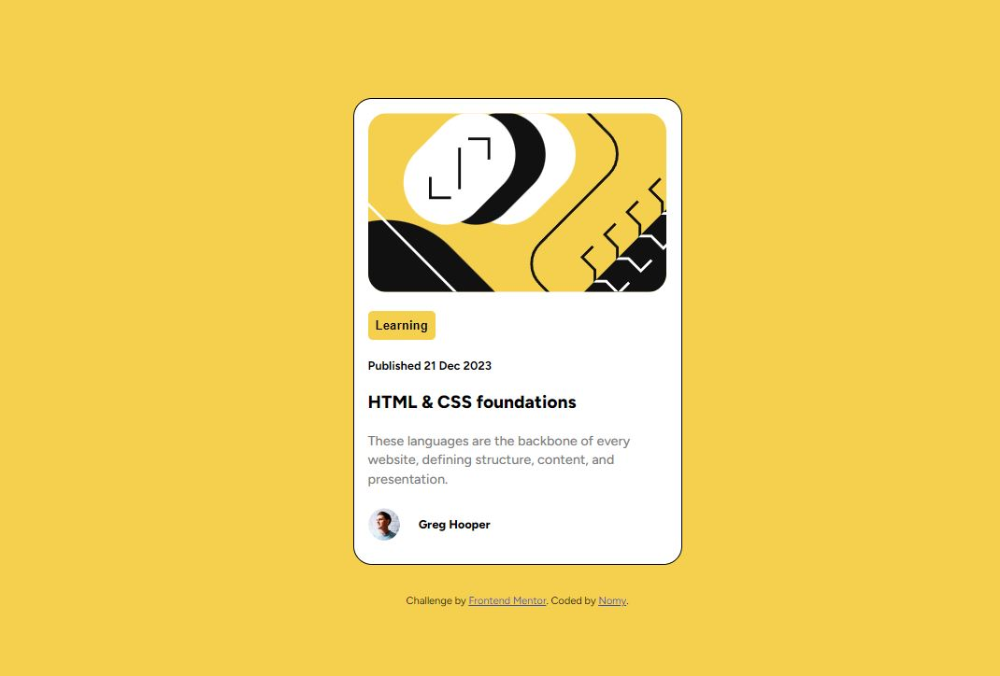

# Frontend Mentor - Blog preview card solution

This is a solution to the [Blog preview card challenge on Frontend Mentor](https://www.frontendmentor.io/challenges/blog-preview-card-ckPaj01IcS). Frontend Mentor challenges help you improve your coding skills by building realistic projects. 

## Table of contents

- [Overview](#overview)
  - [The challenge](#the-challenge)
  - [Screenshot](#screenshot)
- [My process](#my-process)
  - [What I learned](#what-i-learned)
  - [Continued development](#continued-development)
- [Author](#author)

## Overview

A great second challenge, building upon the knowledge gained from the first one, but with its differences and new obstacles.

### The challenge

Users should be able to:

- See hover and focus states for all interactive elements on the page

### Screenshot

Here is a screenshot of my work

## My process

I started with the HTML file, creating the different parts that were needed. Then, I created and wrote the CSS file, working my way from top to bottom. Once all of this was completed, I focused on implementing the hover capabilities of the page.

### Built with

- Semantic HTML5 markup
- CSS custom properties
- Flexbox
- CSS Grid
- Mobile-first workflow

### What I learned

This project allowed me to apply the knowledge I gained from the previous challenge (the QR code). Additionally, I expanded my understanding of hover properties.

### Continued development

I think it could be interesting to continue exploring the various possibilities with the hover element. We could create different reactions for the main box when hovering over different elements of the page.

## Author

- Frontend Mentor - [@Nomylim](https://www.frontendmentor.io/profile/Nomylim)
